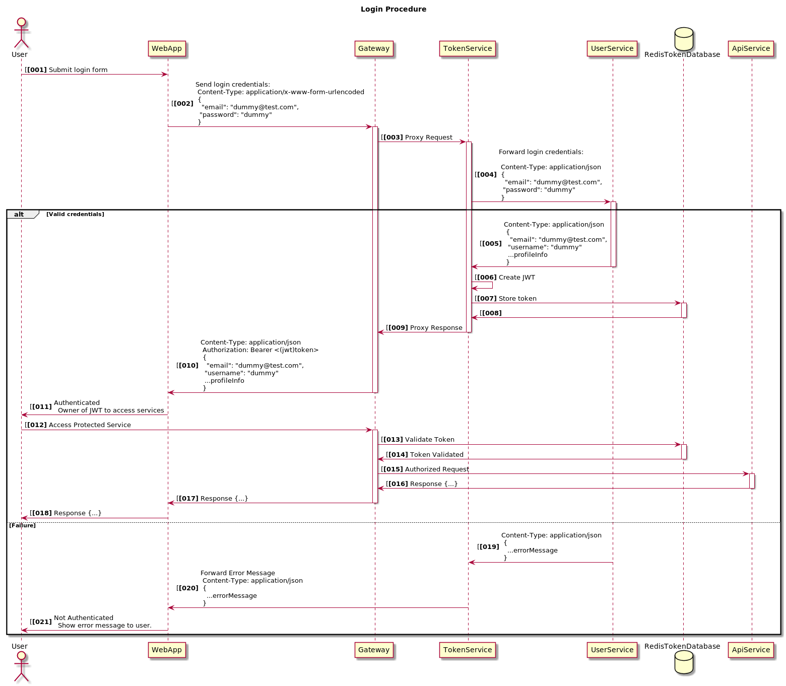

# Authumn Token Server

### Installation

```
$ yarn install
```

### Start

```
$ yarn start
```

### API

Delete()
`http://localhost:2303/token/reject`: Revoke token

Get()
`http://localhost:2303/token/test`: Test Token

Post()
`http://localhost:2303/token/create : Create new token

Post()
`http://localhost:2303/token/refresh : Refresh token

### Diagram

Broad overview of the login procedure, registration follows a similar path.




